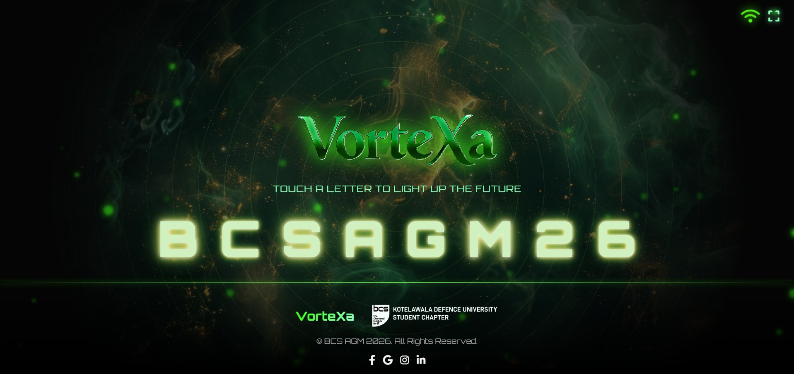

```mermaid
graph TD;
    subgraph "User's Device"
        A[<i class='fa fa-user'></i> User] --> B[Browser];
    end
    
    subgraph "Web Application (Client)"
        style B fill:#050505,stroke:#39ff14,stroke-width:2px
        B -- "Clicks Letter" --> C[script.js];
        C -- "Writes state to /lights/{id}" --> FB;
        C -- "Listens for changes on /status/timestamp" --> FB;
    end

    subgraph "Google Firebase (Cloud)"
        FB["<i class='fa fa-database'></i> Realtime Database"];
    end

    subgraph "Physical Device (Backend)"
        style H fill:#050505,stroke:#88ffb8,stroke-width:2px
        FB -- "Streams /lights data" --> H[esp32_lamp.ino];
        H -- "Writes heartbeat to /status/timestamp" --> FB;
        H -- "Controls GPIO" --> J[Relay Module];
    end

    subgraph "Physical Hardware"
        style M fill:#050505,stroke:#39ff14,stroke-width:2px
        J -- "Switches Power" --> M[<i class='fa fa-lightbulb'></i> Physical Bulb];
    end
```

# 💡 BCS AGM 26 Digital Oil Lamp


Welcome to the repository for the **BCS AGM 26 Digital Oil Lamp**, an interactive, web-controlled art installation. This project uses an ESP32 and the Google Firebase platform to transform a simple se[...]  

**🌐 Live Demo:** https://bcs-agm-26.web.app



## ✨ Features

- **Interactive Control**: Click on letters in the web UI to toggle 8 individual physical bulbs in real-time.
- **Responsive Neon UI**: A futuristic, cyberpunk-inspired interface with glitch effects, glowing text, and dynamic animations.
- **Real-time ESP32 Status**: A live icon shows whether the lamp controller is online, with its status pushed via a Firebase heartbeat.
- **Robust Failsafe Mode**: If the ESP32 loses WiFi connection, it automatically turns all lights on, ensuring the exhibit is never dark.
- **Immersive Experience**: Features like full-screen mode, a parallaxing "ghost" background, and floating particle effects create a captivating user experience.
- **Dynamic Feedback**: The UI provides instant visual feedback for user actions, including click animations and success/error alerts.
- **State Persistence**: The browser remembers the state of the lamps using `localStorage`, so your configuration isn't lost on a page refresh.
- **Hidden Easter Egg**: Includes a Konami code easter egg for a fun surprise!

---

## 🏛️ System Architecture

This project uses **Firebase Realtime Database** as a bridge between the web interface and the ESP32 microcontroller, allowing for control over the internet without requiring devices to be on the same[...]  



---

## 🛠️ Setup and Installation

To get the project running, you need to set up the hardware (ESP32 and bulbs) and the software (Arduino code and web files).

### Hardware Requirements

- **ESP32 Development Board**: The brain of the operation.
- **8 Bulbs**: Low-voltage bulbs (e.g., 12V) are recommended for safety.
- **8-Channel Relay Module or Transistors**: To safely switch the bulbs with the ESP32's low-voltage GPIO signals.
- **Power Supply**: A power supply appropriate for your bulbs (e.g., a 12V power adapter).
- **Breadboard and Wires**: For connecting everything.

#### Wiring Guide

1.  **Connect ESP32 to Relay Module**: Connect the GPIO pins defined in `esp32_lamp.ino` to the input pins (`IN1`, `IN2`, etc.) of the relay module.
    - `bulbPins[0]` (GPIO 13) -> `IN1`
    - `bulbPins[1]` (GPIO 12) -> `IN2`
    - ...and so on for all 8 bulbs.
2.  **Connect Power to Relays and Bulbs**:
    - Connect the positive terminal of your 12V power supply to the positive terminal of each bulb.
    - Connect the negative terminal of the 12V power supply to the `COM` (Common) port of each relay channel.
    - Connect the `NO` (Normally Open) port of each relay channel to the negative terminal of its corresponding bulb.
3.  **Power the ESP32**: Power the ESP32 board via its USB port.

> **⚠️ Safety Warning**: Always be cautious when working with electricity. Ensure your power supply matches your bulb's voltage requirements. It's safer to build and test the circuit with the main[...]  

### Software Configuration

#### 1. Backend (ESP32)

1.  **Setup Arduino IDE**:
    - Install the Arduino IDE.
    - Add the ESP32 board to your IDE. Follow this guide.
    - No external libraries are needed beyond the standard `WiFi` and `WebServer` included with the ESP32 core.

2.  **Configure `esp32_lamp.ino`**:
    - Open the `esp32_lamp.ino` file.
    - Replace the placeholders with your credentials:
      ```cpp
      #define WIFI_SSID "YOUR_WIFI_SSID"
      #define WIFI_PASSWORD "YOUR_WIFI_PASSWORD"
      #define FB_API_KEY "YOUR_FIREBASE_API_KEY"
      #define FB_PROJECT_ID "YOUR_FIREBASE_PROJECT_ID"
      #define FB_USER_EMAIL "YOUR_FIREBASE_USER_EMAIL"
      #define FB_USER_PASSWORD "YOUR_FIREBASE_USER_PASSWORD"
      ```
    - Verify the `bulbPins` array matches the GPIO pins you wired to the relay module.
      ```cpp
      const int bulbPins = { 13, 12, 14, 27, 26, 25, 33, 32 };
      ```

3.  **Upload the Code**:
    - Connect your ESP32 to your computer.
    - Select the correct board (e.g., "ESP32 Dev Module") and Port in the Arduino IDE.
    - Click the "Upload" button.
    - Open the Serial Monitor (baud rate 115200) to see the connection status and find the ESP32's IP address. Note this IP down!

#### 2. Frontend (Web Interface)

1.  **Configuration**:
    - Replace the placeholders in `script.js` with your Firebase config from **Firebase Console > Project Settings > Your apps**.
    - Ensure **Anonymous Authentication** is enabled in your Firebase Console.

2.  **Host the Web Files**:
    - **Firebase Hosting**:
      1. **Create Project in Console**:
         - Go to Firebase Console.
         - Click **Add project**, name it (e.g., bcs-agm-26), and create it.
      2. **Deploy via Terminal**:
         - Install Firebase CLI: `npm install -g firebase-tools`
         - Run `firebase login`
         - Run `firebase init hosting`
           - Select "Use an existing project" -> Choose the one you just created.
           - Public directory: `.` (current directory).
           - Configure as single-page app: `No`.
           - Overwrite index.html: `No`.
         - Run `firebase deploy`

---

## 📂 File Structure

```
BCS AGM 26/
├── esp32_lamp.ino      # Arduino code for the ESP32 (Backend)
├── index.html          # The main HTML file for the web interface (Frontend)
├── style.css           # All styling for the web interface
├── script.js           # JavaScript for interactivity, API calls, and animations
├── README.md           # This file!
└── img/
    ├── Ghost.png           # Logo and icon images
    ├── Background.png      # Parallax background image
    └── ...                 # Other image assets
```

---

## 📡 Firebase Data Structure

The system uses the Firebase Realtime Database to sync state.

### `/lights`

Stores the state of each individual bulb.

 - **Path**: `/lights/{bulb_index}`
 - **Value**: `string` ("on" or "off")
 - **Example**: `/lights/0` -> "on"

### `/status`

Used for the heartbeat mechanism to detect if the ESP32 is online.

 - **Path**: `/status/timestamp`
 - **Value**: `number` (Unix timestamp)

---

## 🎨 Creative Credits

This project was designed to be more than just functional; it's an experience. The visual theme is heavily inspired by cyberpunk and modern tech aesthetics.

- **Fonts**: Orbitron is used for its futuristic, technical feel.
- **Animations**: The interface is brought to life with CSS animations, including a text glitch effect, a breathing ghost background, and glowing letters.
- **Particles.js**: A custom, lightweight particle animation in JavaScript creates a dynamic, floating orb effect in the background.
- **Konami Code**: A classic video game easter egg (`↑ ↑ ↓ ↓ ← → ← → B A`) was included for an extra layer of fun.

## Troubleshooting

- **Letters don't light up**:
  1. Check the browser's developer console (F12) for `fetch` errors.
  2. Ensure the `firebaseConfig` in `script.js` is correct.
  3. Check the ESP32's serial monitor for any error messages.

- **Status icon is red (Offline)**:
  - This means the ESP32 has stopped sending heartbeats to Firebase. Check the ESP32 power and WiFi connection.

- **All lights are on, but nothing is clickable**:
  - This is the failsafe mode. It means the ESP32 could not connect to WiFi at startup or lost its connection. Check your WiFi credentials in `esp32_lamp.ino` and restart the ESP32.

---

&copy; BCS AGM 26 2026. All Rights Reserved.